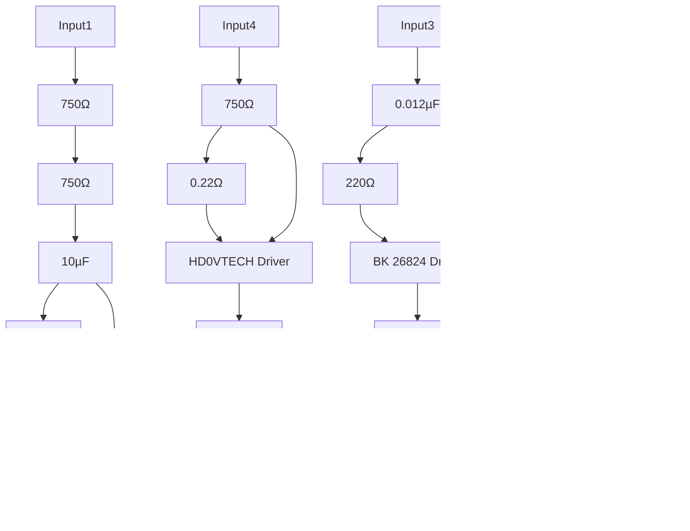

# Project Resonator 4 Way Passive Crossover Diagram [For 4BA Driver Configuration]

```mermaid
graph TD

    %% === BRANCH 1: CI_22955 ===
    Input1 --> R1_750_1[750Ω]
    R1_750_1 --> R1_750_2[750Ω]
    R1_750_2 --> C1_10uF[10µF]
    C1_10uF --> R1_750_3[750Ω]
    R1_750_3 --> CI_22955["CI 22955 Driver"]
    C1_10uF --> CI_22955
    CI_22955 --> GND1[Ground]

    %% === BRANCH 4: HD0VTECH ===
    Input4 --> R4_750[750Ω]
    R4_750 --> R4_0_22[0.22Ω]
    R4_0_22 --> HD0VTECH["HD0VTECH Driver"]
    R4_750 --> HD0VTECH
    HD0VTECH --> GND4[Ground]

    %% === BRANCH 2: TWFK-30017 ===
    Input2 --> C2_0_039uF[0.039µF]
    C2_0_039uF --> R2_300[300Ω]
    R2_300 --> C2_4_7uF[4.7µF]
    C2_4_7uF --> TWFK_30017["TWFK-30017 Driver"]
    R2_300 --> TWFK_30017
    TWFK_30017 --> GND2[Ground]

    %% === BRANCH 3: BK 26824 ===
    Input3 --> C3_0_012uF[0.012µF]
    C3_0_012uF --> R3_220[220Ω]
    R3_220 --> BK_26824["BK 26824 Driver"]
    C3_0_012uF --> BK_26824
    BK_26824 --> GND3[Ground]
```