# Project Resonator | *The* Open-Source IEM Initiative
> A love letter to the IEM/CIEM hobby.

**📖 Documentation Website:** [https://driftingotter.github.io/Project-Resonator-Web/](https://driftingotter.github.io/Project-Resonator-Web/)

---

## What is Project Resonator?

Project Resonator is a comprehensive knowledge base and resource repository for the complete design cycle and engineering development of in-ear monitors (IEMs). The project aims to bridge the gap between hobbyist curiosity and professional-grade IEM development by providing both the technical resources and educational foundation needed to understand and create high-fidelity audio devices.

### Core Resources

Project Resonator provides a complete suite of engineering resources:

- **CAD Shell Design Files** — Parametric 3D models for ergonomic IEM housings
- **Crossover Simulation Circuits** — Fully documented acoustic crossover networks in VituixCAD
- **PCB Design Files** — Production-ready circuit board layouts in KiCad format
- **Driver Characterization Data** — Frequency response and impedance measurements for balanced armature, dynamic, and electrostatic drivers

These resources are designed for both DIY enthusiasts exploring personal audio projects and aspiring entrepreneurs researching entry into the IEM market who may lack formal training in acoustics or electrical engineering.

### Educational Framework

Beyond physical assets, Project Resonator's primary value lies in its structured tutorial system that demystifies each stage of IEM development:

- **Driver Technology & Selection** — Understanding the physics and performance characteristics of transducer types
- **Crossover Circuit Design** — Acoustic filter theory and frequency division network topology
- **PCB Engineering in KiCad** — Translating schematic designs into manufacturable circuit boards
- **CAD Modeling for Acoustics** — Shell geometry, acoustic chambers, and sound bore design in Fusion 360

By consolidating these resources into a single, cohesive repository, Project Resonator enables users to understand the technology they use daily and provides a foundation for experimentation, innovation, and research & development in personal audio.

### Open-Source Collaboration

The open-source nature of this project allows the community to contribute to a centralized knowledge base, helping others in the same pursuit by:

- Improving and expanding existing documentation
- Contributing additional design files and measurement data
- Sharing novel tuning approaches and manufacturing techniques
- Building supplementary tools and resources for IEM development

Project Resonator serves as a living resource that evolves with the IEM community, fostering innovation through shared knowledge and collaborative development.

---

## The Reference Design (Template)

While the guides apply to *any* IEM project, we provide a complete set of files for a specific "Reference" model to get you started.

**Configuration:** All-BA 4-Driver (1× Low + 1× Mid + 2× High)

**Drivers:**
- Knowles CI-22955 (Low)
- Knowles BK-26824 (Mid)
- Knowles SWFK-31736 (Highs)

**Target Tuning:** Similar to the *Moondrop x Crinacle DUSK*

**Estimated Build Cost:** ~$200-300

### Reference Crossover Diagram

```mermaid
graph LR
    Input[Source Input] --> Woofer_Path[Woofer Path<br/>CI-22955]
    Input --> Mid_Path[Mid Path<br/>BK-26824]
    Input --> High_Path[High Path<br/>SWFK-31736]
    
    Woofer_Path --> R1[22Ω Series]
    R1 --> C1[4.7µF Parallel]
    C1 --> Woofer[CI-22955<br/>BA Woofer]
    
    Mid_Path --> C2[10µF Series]
    C2 --> R2[22Ω Series]
    R2 --> C3[4.7µF Parallel]
    C3 --> Mids[BK-26824<br/>BA Mids]
    
    High_Path --> T1_Path[Tweeter 1]
    High_Path --> T2_Path[Tweeter 2]
    
    T1_Path --> C4[2.2µF Series]
    C4 --> R3[6.8Ω Parallel]
    R3 --> Tweeter1[SWFK-31736<br/>Unit A]
    
    T2_Path --> C5[2.2µF Series]
    C5 --> R4[22Ω Parallel]
    R4 --> Tweeter2[SWFK-31736<br/>Unit B]
    
    style Woofer fill:#1a1a1a
    style Mids fill:#1a1a1a
    style Tweeter1 fill:#1a1a1a
    style Tweeter2 fill:#1a1a1a
    style Input fill:#1a1a1a
```

**Note:** The reference tuning is highly individualized. The project's purpose is to provide all necessary tools and resources pre-configured, allowing you to use this as a foundation to tune and create an IEM tailored to your preferences.

---

## 🔧 Technologies Used & Software Required

1. **VituixCAD** — Tuning simulation and acoustic crossover design
2. **KiCad** — Schematic and PCB design
3. **Autodesk Fusion 360** — CAD modeling for IEM shells
4. **FPGraphTracer** — Extracting frequency and impedance responses from driver spec sheets

**Additional Resources:**
- [YouTube Playlist: IEM Building Resources](https://youtube.com/playlist?list=PL4ahDGGN5zBFhmGqVUoBdOnjuF_9HXV5L)
- [Full Documentation Website](https://driftingotter.github.io/Project-Resonator-Web/)

---

## 🛠️ Installation & Setup Guide

### VituixCAD Setup

1. Download VituixCAD from [https://kimmosaunisto.net/](https://kimmosaunisto.net/)
2. Install and open the `.vxp` simulation file included in this repository
3. **Fix missing file paths:**
   - You'll likely see "missing file path" errors on first load
   - Click the folder icon next to each `.frd` or `.zma` file slot
   - Navigate to the `BA Driver Spec Sheets` folder in this repo
   - Re-link the appropriate files for each driver

*(This only needs to be done once per project file)*

### Downloading IEM Shell Files

All IEM shell files are hosted externally on **MEGA** due to GitHub's file size limitations.

🔗 **[Download Shell Files from MEGA](https://mega.nz/folder/2Z4WzYDR#g-NULd1YQFsHa81YXLZzIw)**

The archive includes:
- **Ready-To-Print** — `.stl` files for direct 3D printing
- **Fusion-Shell-Models** — Editable `.f3d` files for customization in Fusion 360

---

## 📚 Documentation

Complete guides are available on the [Project Resonator Documentation Website](https://driftingotter.github.io/Project-Resonator-Web/), including:

### Engineering & Design
- [Driver Selection](https://driftingotter.github.io/Project-Resonator-Web/docs/Driver-Selection)
- [Crossover Design](https://driftingotter.github.io/Project-Resonator-Web/docs/Crossover-Design)
- [Crossover Tuning](https://driftingotter.github.io/Project-Resonator-Web/docs/Crossover-Tuning)
- [Component Picking](https://driftingotter.github.io/Project-Resonator-Web/docs/Component-Picking)

### Manufacturing & CAD
- [PCB Design](https://driftingotter.github.io/Project-Resonator-Web/docs/PCB-Design)
- [Shell Design](https://driftingotter.github.io/Project-Resonator-Web/docs/Shell-Design)
- [Shell Material and Manufacturing](https://driftingotter.github.io/Project-Resonator-Web/docs/Shell-Material-and-Manufacturing)

### Project Information
- [Tools & Software](https://driftingotter.github.io/Project-Resonator-Web/docs/Tools-&-Software)
- [Project Goals & Philosophy](https://driftingotter.github.io/Project-Resonator-Web/docs/Project-Goals-Philosophy)
- [Project Licensing and Usage](https://driftingotter.github.io/Project-Resonator-Web/docs/Project-Licensing-and-Usage)
- [FAQ & Troubleshooting](https://driftingotter.github.io/Project-Resonator-Web/docs/FAQ-Troubleshooting)
- [How to Contribute](https://driftingotter.github.io/Project-Resonator-Web/docs/Contribution)

---

## ❓ Can I Use These Files To Build My Own IEM?

**Absolutely.** This project is licensed under **CERN-OHL-W** (weakly reciprocal), which allows you to:

- Build IEMs for personal use
- Modify and improve the designs
- Use this as a foundation for commercial projects

The license maintains the open-source spirit while being permissive enough for commercial applications. For full details, see the [Project Licensing and Usage](https://driftingotter.github.io/Project-Resonator-Web/docs/Project-Licensing-and-Usage) documentation.

**Note:** This design represents a learning journey and is far from perfect—but it provides a solid foundation and realistic look at what an IEM build process entails. Use it as a starting point to avoid some of the mistakes made along the way.

---

## 🤝 Contributing

Project Resonator welcomes contributions from the community! Whether you're improving documentation, adding measurement data, sharing tuning variants, or fixing errors, your input helps everyone.

See the [Contribution Guide](https://driftingotter.github.io/Project-Resonator-Web/docs/Contribution) for details on how to get involved.

---

## 🚧 Current Status & Community Testing

**Important:** The reference design has not yet been physically tested by the project author due to budget constraints (~$300 build cost). If you build this design, your feedback and measurements would be invaluable to the community. Please share your results and listening impressions!

---

## 👨‍💻 Author

**Daksh Kaul** (DriftingOtter)

---

## 🙌 Credits & Acknowledgments

Special thanks to:

- **Head-Fi DIY IEM Community** — For fostering knowledge sharing and experimentation
- **[Kozh](https://www.youtube.com/@kozh4013/videos)** — IEM design tutorials and insights
- **[Kirby Meets Audio](https://youtu.be/QClvPIuW3zI)** — Driver selection and acoustic theory
- **[Crinacle](https://www.youtube.com/watch?v=tCqV3ZRcZ9g)** — Measurement methodology and target curves
- **[Mr.T's Design Graveyard](https://youtu.be/3FGNw28xBr0)** — PCB design techniques

*If I've forgotten to credit you, please reach out—contributions are always acknowledged.*

---

## 📄 License

This project is licensed under **CERN Open Hardware Licence Version 2 - Weakly Reciprocal** (CERN-OHL-W).

See [LICENSE](./LICENSE) or the [Project Licensing Documentation](https://driftingotter.github.io/Project-Resonator-Web/docs/Project-Licensing-and-Usage) for full details.
