# __Project Resonator | *The* Open-Source IEM.__  
> A love letter to the IEM/CIEM hobby.

## 🔧 Technologies Used & Software Required

1. **VituixCAD**             — Tuning simulation (see install guide below)  
2. **KiCad**                 — Schematic and PCB design  
3. **Autodesk Fusion**       — Designing the IEM shell  
4. **FPGraphTracer**         — Tracking frequency and impedance responses from driver spec sheets  
5. **Python + Tkinter**      — Bluetooth Control Application (see below)

## 📅 Development Timeline

- [x] Modified PCB Shape To Wrap Entire Shell | PCB Design
- [x] Re-arranged Drivers To Fit Better       | Drivers
- [X] Created New IEM Colorways               | Design & Prototyping
- [+] [Modular, Node-based Tuning Software](https://github.com/DriftingOtter/EarCanvas)     | Software

- [x] Tools & Software                        | Wiki Entry  
- [x] Driver Selection                        | Wiki Entry  
- [+] Crossover Design                        | Wiki Entry  

...  
_More to come._

## 🎧 Philosophy & Reasoning

> I fell in love with IEMs, so I decided "why not, I'm bored."

## ❓ *Can I Use These Files To Build My Own IEM?*

Absolutely. I’ve set the license to be lenient for anyone who wants to use this as a base for their own commercial projects—while still keeping that open-source spirit that I’ve grown to love in the comp sci world.

I hope this gives you a head start—maybe even helps you dodge some of the mistakes I made.

*Reminder: I’m still human, and this design is far from perfect—but it should give you a solid look at what an IEM build process can look like.*

### 📄 Official Module Documentation

Refer to the official programming documentation for the FSC-BT6038 module here:  
🔗 [BT6038A Programming User Guide](https://document.feasycom.com/docs/audio/BT6038_EN/latest/BT6038A_programming_user_guide.html)

## Project Resonator 4 Way Passive Crossover Diagram [For 4BA Driver Configuration]

```mermaid
graph TD

    %% === BRANCH 1: CI_22955 ===
    Positive --> R1_750_1[750Ω]
    R1_750_1 --> R1_750_2[750Ω]
    R1_750_2 --> C1_10uF[10µF]
    C1_10uF --> R1_750_3[750Ω]
    R1_750_3 --> CI_22955["CI 22955 Driver"]
    C1_10uF --> CI_22955
    CI_22955 --> GND1[Ground]

    %% === BRANCH 2: TWFK-30017 ===
    Positive --> C2_0_039uF[0.039µF]
    C2_0_039uF --> R2_300[300Ω]
    R2_300 --> C2_4_7uF[4.7µF]
    C2_4_7uF --> TWFK_30017["TWFK 30017 Driver"]
    R2_300 --> TWFK_30017
    TWFK_30017 --> GND1[Ground]

    %% === BRANCH 3: BK 26824 ===
    Positive --> C3_0_012uF[0.012µF]
    C3_0_012uF --> R3_220[22Ω]
    R3_220 --> BK_26824["BK 26824 Driver"]
    C3_0_012uF --> BK_26824
    BK_26824 --> GND1[Ground]

    %% === BRANCH 4: HODVTECH ===
    Positive --> R4_750[750Ω]
    R4_750 --> R4_0_22[0.22Ω]
    R4_0_22 --> HODVTECH["HODVTECH Driver"]
    R4_750 --> HODVTECH
    HODVTECH --> GND1[Ground]
```

## 🛠️ Installation Guide

### VituixCAD (Archived Version) + Fixing Missing File Paths

1. Go to [Internet Archive's Wayback Machine](https://archive.org/)  
2. Paste: `https://kimmosaunisto.net/`  
3. Find and download any version before **2018-04-25**  
4. Install it and open the `.vxp` simulation file included in this project  

You’ll probably get a bunch of “missing file path” errors—don’t worry. That just means the project is still pointing to paths from my own system.

To fix:
- Click the folder icon next to the `.frd` or `.zma` file slot
- Navigate to the correct folder for each BA driver (inside the `BA Driver Spec Sheets` folder in this repo)
- Re-link the appropriate files

*(You only need to do this once.)*

### Downloading Fusion 360 IEM Shell Files

All IEM shell files are now hosted on **MEGA**. This includes both `.stl` files for direct printing and `.f3d` Fusion files for editing.

Since GitHub has upload limits, I’ve stored them externally here:

🔗 [Mega Link For IEM Shell Files](https://mega.nz/folder/2Z4WzYDR#g-NULd1YQFsHa81YXLZzIw)

Inside, you'll find:

- `Ready-To-Prints`     | Shell prototypes you can print right away  
- `Fusion-Shell-Models` | Editable Fusion files to tweak however you’d like

---

## 👨‍💻 Author

- **Daksh Kaul** (aka. *DriftingOtter*)

## 🙌 Credits & Citations

- Head-Fi DIY IEM forums & community  
- [Kozh](https://www.youtube.com/@kozh4013/videos)  
- [Kirby Meets Audio](https://youtu.be/QClvPIuW3zI?si=NcwjdGAZriBUcmHE)  
- [Crinacle](https://www.youtube.com/watch?v=tCqV3ZRcZ9g&t=1227s)  
- [Mr.T’s Design Graveyard](https://youtu.be/3FGNw28xBr0?si=LEpJtPCjVtikS_FK)  
- *And many more...*  

*If I forgot to credit you, shoot me a message—I’ll make sure you’re added.*

